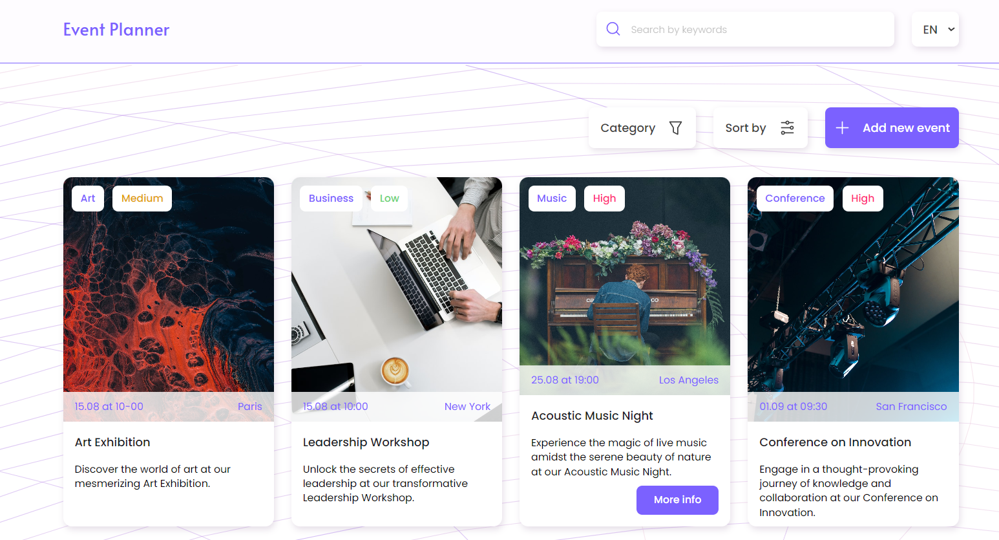

# Event Planner Web App

Event Planner is a web application that allows users to plan and organize events. It provides features for creating, viewing, and managing events.

## Technologies Used

- React
- JavaScript

## Setup and Usage

1. Clone the repository to your local machine.
2. Install project dependencies using `npm install`.
3. Run the development server using `npm start`.
4. Open your web browser and navigate to `http://localhost:3000`.

## Available Scripts

In the project directory, you can run:

- `npm start`: Starts the development server.
- `npm build`: Builds the app for production.
- `npm test`: Runs tests.
- `npm run eject`: Ejects the app from Create React App.
- `npm run deploy`: Deploys the app to GitHub Pages.
- `npm run predeploy`: Builds the app before deployment.

## Live Demo

Check out the [live demo](https://qweeqer.github.io/event-planner/) of the Event Planner web app on GitHub Pages.

## Backend

This project uses the mockapi.io backend with the following schema:

- **id**: Object ID
- **title**: STRING
- **date**: DATE
- **time**: STRING
- **location**: STRING
- **description**: STRING
- **category**: STRING
- **priority**: NUMBER
- **picture**: STRING

## Task Description

Create an Event Planner web application that allows users to plan and organize events. The application should have the following features:

- Main page displaying a list of upcoming events with basic information.
- Event creation page with a form for users to input event details such as title, date, time, location, description, etc.
- Event details page showing detailed information about a specific event.
- (Advanced) Event editing page where users can edit event details.
- (Intermediate) Add filtering events by categories on the main page.
- (Intermediate) Enhance the event creation form by adding category selection.
- (Intermediate) Allow event deletion on the event details page.

For higher complexity, consider adding:

- Prioritizing events with different colors on the main page.
- Setting event priorities during event creation/editing.
- Editing event details from the event details page.

## Requirements

- Responsive and semantic HTML/CSS. Use Mobile First approach.
- Accessibility (a11y) considerations.
- Clean and well-formatted code. Consider using ESLint/Prettier.
- Code should be organized into separate components.
- Use of CSS Grid for event list layout (basic level).

## Additional Ideas

For additional inspiration, consider adding these features:

- Sorting events by different criteria (e.g., title, date, priority).
- Event search functionality by title or description.
- Pagination on the main page.
- Multilingual support using react-i18next.

Feel free to extend and improve upon the provided specifications as you see fit.
